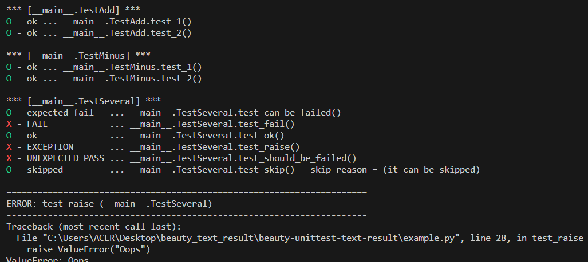

# beauty-unittest-text-result
The default output format of `unittest` is ugly for me. The horizontal position of test result is changed line by line, makes it difficult to tell at a glance which tests are failing.  

The `BeautyTextResult` groups the output of all test cases into difference sections, and marks the result token at the beginning of the line, make it easy to see which test case is failed.

(note: it only works for `verbosity > 1`. For `verbosity == 1`, it will apply the default simple output.)

# Usage
```python
import unittest
import text_result
runner = unittest.TextTestRunner(resultclass=text_result.BeautyTextResult, verbosity=2)
unittest.main(testRunner=runner)
```

output (by running `example.py`):




# Dependicies
python 3.6+

# Disable Colored Output
The output will be colored by ANSI color code ([stackoverflow reference](https://stackoverflow.com/a/287944)). If the ANSI color code is not avaiable, it can be disabled by
```python
text_result.BeautyTextResult.COLORED = False
``` 

# TODO
The [colored output](#disable-colored-output) is implemented by ANSI color code currently. Use other library (e.g. [colorama](https://pypi.org/project/colorama/)) for cross platform compatibility may be more appropriate.